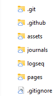
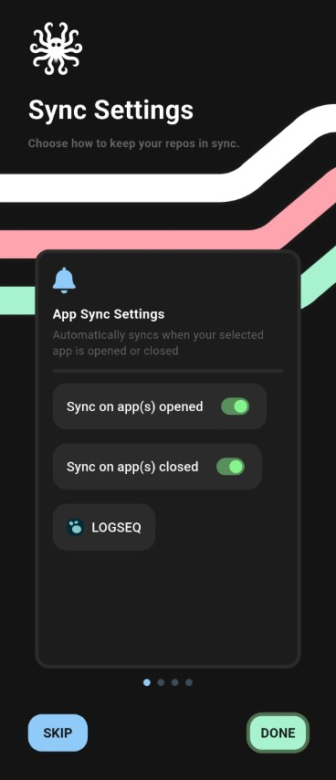

# The problem

I want to be able to use Logseq on multiple PCs and on a phone and have the data syncing automatically. Keeping a Logseq graph in sync across multiple devices is surprisingly tricky: desktop apps can run background sync, but on Android apps are resource-limited and can't reliably run background hooks. That leads to missed changes, conflicts, and manual steps unless you automate the process. And even the paid solutions are not always reliable.

## Warning before you read further

The Android solution below relies on an app that uses the Accessibility API to detect when Logseq opens or closes. That API can observe screen contents, so only enable it for apps you trust. Treat this as higher-risk than normal: prefer scoped tokens, review the app's source if possible, and avoid granting broad permissions unless necessary.

## Solution overview

Our goal: keep a single, canonical Logseq graph in a private Git repository and ensure each device (desktop, laptop, phone) both receives the latest changes and send the latest changes, so you have all your logseq notes in one place always up to date, without manual interventions.

**How this looks in practice:**
- Desktop: Logseq app auto-commits locally, using the built in version control feature. Git hooks ensure a pull-before-commit and push-after-commit so changes flow to the remote automatically.
- Android: a sync app detects when Logseq opens/closes and runs pull/push operations for the repository.

### Note on existing solutions
In the past I have tried using Google Drive for syncing on PC and Syncthing client on Android, but I never got it to work reliable. From time to time, usually when I needed it the most, I would run into conflicts and had to manually resolve them before being able to continue. That put me away. I also tried one drive and FolderSync, but was never really satisfied with the results. There is also Sync service right from the Logseq developers, but it's not free and when I was trying it it had similar conflict issues, so for some time I gave up on logseq and kept using OneNote.. but Logseq is just so much better than I tried again and so far I am very happy with it.

# Show me how already! 
Here's how to set up the syncing on both platforms. I am using Logseq on Windows, but the PC setup is the same for MacOs and Linux. I am using Android on my phone, so this post is about Android, if you are using iOS you might get inspired, there might be equivalent solution, but I kinda doubt it.

## On PC

### Prerequisites
- Git client installed (Windows: `winget install Git.Git`) as of writing I am using Git 2.53.0, but it should work with older versions too.
- Logseq desktop installed. As of writing, I am using 0.10.15.

### Steps
1. Clone a private Git repository and put your Logseq graph inside it. You should see the .git folder alongside Logseq folders such as assets/ and journals/.

   

2. In Logseq: Settings → Version Control, enable "Git auto commit" and "Git commit on window close". Choose an auto-commit interval (I use 60 seconds).
3. Add Git hooks to automate pull and push.

Pre-commit hook (save as .git/hooks/pre-commit):

```bash
#!/bin/sh
# Pull latest before committing to reduce conflicts
output=$(git pull --no-rebase 2>&1)

if [ "$output" = "Already up to date." ]; then
    :
else
    echo "${output}"
fi

git add -A
```

Post-commit hook (save as .git/hooks/post-commit):

```bash
#!/bin/sh
# Push changes to remote (change branch if needed)

git push origin main
```

> Note: adjust the branch name (main/master) to match your repo. Ensure the hooks are executable on your system.

## On Android

Android doesn't support the same background filesystem hooks, because you cannot use git client directly as on windows + the Logseq version control system options for auto commit are not available on android (for the same reasons I assume), so a helper app is needed. I was doing some search around and ended up using [GitSync](https://play.google.com/store/apps/details?id=com.viscouspot.gitsync), which can trigger a pull on app start and a push on app exit by using the Accessibility API.

### Steps
1. Install [GitSync](https://play.google.com/store/apps/details?id=com.viscouspot.gitsync) (it is free) and authenticate with your git hosting, like github. I suggest using a scoped token, scoped only to that one repository.
2. Clone your repository into a folder accessible to Logseq (e.g., a "logseq" folder in internal storage).
3. Configure GitSync to pull on Logseq start and push on Logseq exit.



That's it! Really. Now you can use Logseq on both PC and Android and have the data syncing automatically. It is not perfect, so there are few caveats to keep in mind:
- **One-minute rule**: Desktop auto-commit intervals create a short window where edits may not be visible elsewhere. Wait ~1 minute after editing on one device before opening Logseq on another to reduce conflicts.
- **Offline editing**: If you edit the same files on multiple devices while offline, conflicts can occur, so either avoid that, or work in different files or try not to edit the same lines, otherwise you will need to manually resolve the conflict using git merge.
- **Accessibility API risk**: Apps that use this API can read screen content. Use with caution.

## Credentials and security notes
- Prefer scoped tokens for github authentication.
- Don't allow more permissions than necessary.
- Be careful when updating the GitSync app. I did some background checks and it seems safe at the moment, so I would pin the version so android doesn't update it automatically. And if you need to update it, I would do research on the health of the repo again. As I said, **it has permissions to see your screen**! It is not using those at the moment, but you never know in the future. We heard about too many supply chain attacks... especially now that using AI everyone could be a hacker!